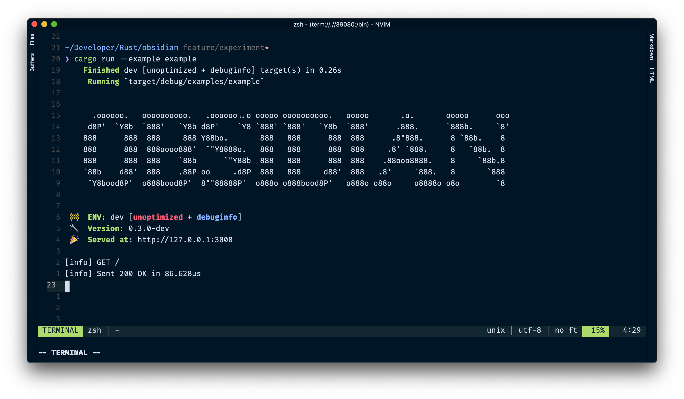

<p align="center">
  <a href="https://obsidian-rs.github.io">
    
  </a>
  <h1 align="center">
    Obsidian
  </h1>
</p>

<p align="center"><strong>Obsidian</strong> is an ergonomic Rust async http framework for reliable and efficient web.</p>

<div align="center">
    <a href="https://crates.io/crates/obsidian">
      
    </a>
    <a href="https://github.com/obsidian-rs/obsidian/actions">
      
    </a>
</div>

<div align="center">
  
</div>

## Get Started
```toml
[dependencies]
# add these 2 dependencies in Cargo.toml file
obsidian = "0.2.2"
tokio = "0.2.21"
```

## Hello World

```rust
use obsidian::{context::Context, App};

#[tokio::main]
async fn main() {
    let mut app: App = App::new();
    app.get("/", |ctx: Context| async { ctx.build("Hello World").ok() });
    app.listen(3000).await;
}
```

## Hello World (with handler function)

```rust
use obsidian::{context::Context, handler::ContextResult, App};

async fn hello_world(ctx: Context) -> ContextResult {
    ctx.build("Hello World").ok()
}


#[tokio::main]
async fn main() {
    let mut app: App = App::new();
    app.get("/", hello_world);
    app.listen(3000).await;
}
```

## JSON Response

```rust
use obsidian::{context::Context, handler::ContextResult, App};
use serde::*;

async fn get_user(ctx: Context) -> ContextResult {
    #[derive(Serialize, Deserialize)]
    struct User {
        name: String,
    };

    let user = User {
        name: String::from("Obsidian"),
    };
    ctx.build_json(user).ok()
}

#[tokio::main]
async fn main() {
    let mut app: App = App::new();
    app.get("/user", get_user);
    app.listen(3000).await;
}

```

## More Example

Example are located in `example` folder. You can run them by using
```bash
// command
cargo run --example [name]

// show a list of available examples
cargo run --example 

// run the example
cargo run --example example
```

## Current State

Under active development and **NOT READY FOR PRODUCTION YET!**
